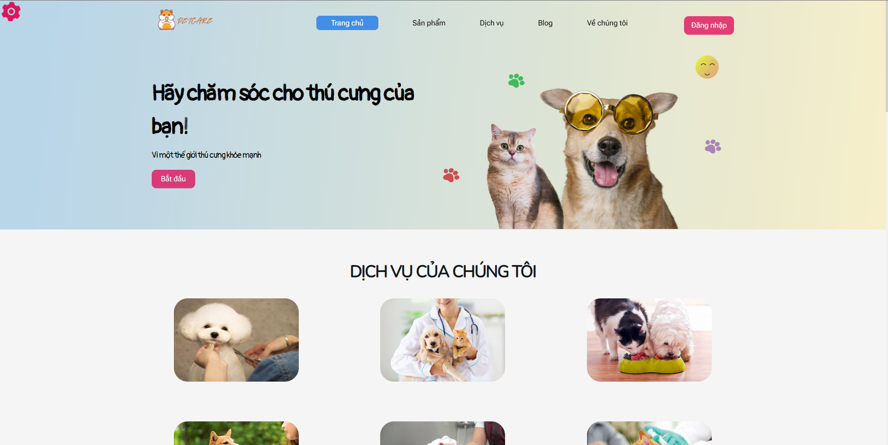
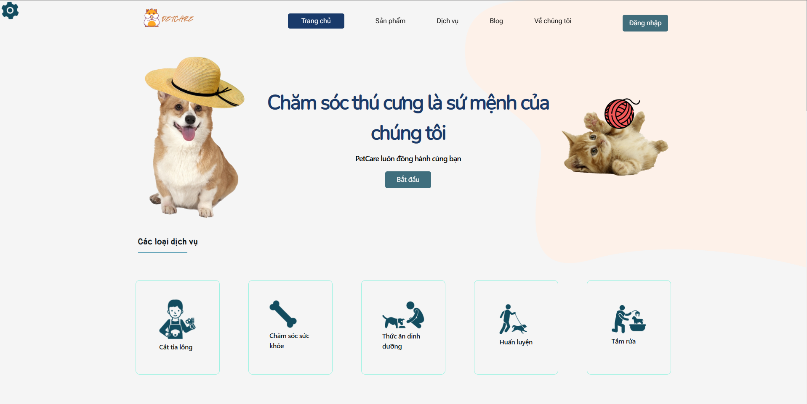

# [REACTJS] PetCare - Website for your pets

## Introduction

Here is my javascript source code with my team for PetCare. There are two following templates:

-   **Template 1**

    

-   **Template 2**

    

## Motivation

My team has decided to implement this project because of the enjoyment of pets. On the other hand, the project is a place where I can learn more about ReactJS Framework. We have made it with Redux, NextUI and other libraries for several months to make it possible to use. As you could see, with minimal setup and simple network's initialization, as long as you can run the application.

## Installation

First time you see this repository, you must clone it and then run the following command:

### `npm install`

Moreover, you should have a backend which is running with ExpressJS and NodeJS. If you don't have, you can clone it from another repository in my github, it is `petcare-be`.
You should also have your database to run successfully.

Next, you will create an .env file in your repository. The environment will be the Google Client Id of your application.

After all the configuration, you can run the following command:

### `npm start`

And... That's all what you need.

## Requirements

-   **nodejs >=14**

## Thank you

Thank you for the excellent contributions of my team to implement this project. I appreciate you if you have any questions and some comments for us to improve this project.
